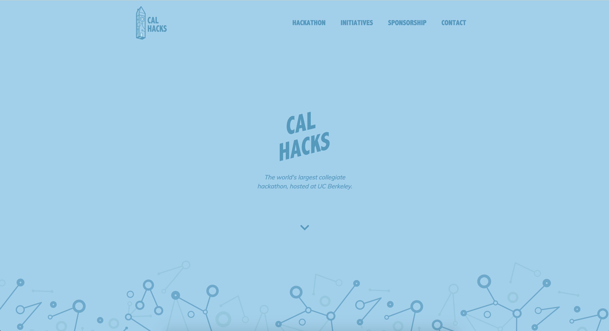

A permanent landing page for an organization establishes both consistency in visual identity and a platform for showcasing its mission. As the world's largest collegiate hackathon, [Cal Hacks](https:calhacks.io) consistently is working to drive initiatives, partner with other teams & companies, and make an impact in the world of tech. As such, I developed a permanent site to go along with the [Cal Hacks brand]() I created.

## Motivation
Previously, Cal Hacks released landing pages for each hackathon iteration and then kept that site up and running on our domain until the next hackathon. This resulted in many inefficiencies such as out-of-date information and lack of clarity in our mission. We frequently received emails from companies asking how and when to sponsor, as well as emails from hackers querying when the next round of applications would open. So, we decided to restructure our domain into a permanent landing page that explains our missions, documents our past hackathons and initiatives, provides resources to companies interested in sponsoring, and hosts announcements in regards to upcoming events along with links to their landing pages.

## Technologies
The site is build in ReactJS, and all designs were mocked up in Sketch.

## Animations
The [Hackanile]() logo I created for Cal Hacks is inspired by a combination of circuitry and data structure-esque graph diagram renditions. As such, I use a lot of node-inspired graphics across Cal Hacks branding assets. The placement of these monochrome nodes against a saturated background to me suggests the appearance of floating &mdash; and so I decided to animate the node assets, hence turning them into a floating network.

I included the nodes as SVGs, and hand-animated each of the vector elements. In the future it might be interesting to algorithmically generate these animations.

## User Testing
Since my branding of Cal Hacks was primarily motivated illustratively, I created a low-contrast color palette of monochrome blues that paralleled my visual design decisions for the logo. However, illustration and interface are two areas of design that to me are most keenly distinct when observed through the lens of usability & accessibility. The primary light blue and dark blue do not pass any [color checker for usability](https://contrastchecker.com/), and as such I was inspired to brainstorm layouts that both maintained the integrity of the brand's visual design and created an accessible interface.

## Implementation Logic
For each of the content pages, I separated the screen into a title and content half. This decision was primarily informed by my desire to maintain the visual design scheme established by the permanent branding while simultaneously addressing the usability results for my user testing on the color palette
