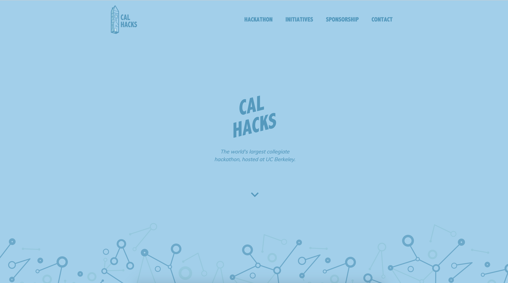

A permanent landing page for an organization establishes consistency in visual identity and a platform for showcasing its mission. As the world's largest collegiate hackathon, [Cal Hacks](https:calhacks.io) consistently is working to drive initiatives, partner with other teams & companies, and make an impact in the world of tech. As such, I developed a permanent site to go along with the [Cal Hacks brand]() I created.



## Motivation
Previously, Cal Hacks released landing pages for each hackathon iteration and then kept that site up and running on our domain until the next hackathon. This resulted in many inefficiencies such as out-of-date information and lack of clarity in our mission. We frequently received emails from companies asking how and when to sponsor, and emails from hackers querying when the next round of applications would open. So, we decided to restructure our domain into a permanent landing page that explains our missions, documents our past hackathons and initiatives, provides resources to companies interested in sponsoring, and hosts announcements in regards to upcoming events along with links to their landing pages.

## Technologies
The site is build in ReactJS, and all designs were mocked up in Sketch.

## Animations
The Hackanile logo I created for Cal Hacks is inspired by a combination of circuitry and data structure-esque graph diagram renditions. As such, I use a lot of 


## Implementation Logic
The logic of the app can be outlined in parallel with the user flow. The user inputs a destination, with autocomplete functionality powered by the [Google Places Autocmplete API](https://developers.google.com/places/web-service/autocomplete). Said destination and the user’s current location are passed to the [Mapbox SDK](https://www.mapbox.com/mobile/) to generate a route, which is rendered to the UI while being parsed into equidistant walks in the backend. The density of each walk is determined as a function of the user’s target time to be at their destination, where a more flexible time correlates to less dense division. Each segment’s endpoint then gets a radius, where again a stricter time constraint reduces the radii of the circles generated by each route segments’ endpoints. These generated circles are then passed to [Yelp Fusion API](https://www.yelp.com/fusion), along with any user-specified, restaurant-related filters, to query for restaurants satisfying all user preferences and time constraints.

The user can these easily browse the returned restaurants, supplemented with details and images from [Google Place Photo](https://developers.google.com/places/web-service/photos) data. Once a restaurant and a mode of transport is selected, in-app navigation to the destination is provided via [Mapbox Navigation](https://www.mapbox.com/navigation/).

In short, the application generates restaurants along a navigatable route that meet all user preferences.

## Mapping
I've recently taken up a fascination with mapping interfaces, so my main implementation responsibility on this project was handling all map-related input, data, and queries.

The interface enables user to select their desired mode of transit to the final destination, which is then passed as a &nbsp;```DirectionsCriteria```&nbsp; to Mapbox.

```java
vBike.setOnClickListener(new View.OnClickListener() {
  @Override
  public void onClick(View view) {
      PROFILE_TYPE = DirectionsCriteria.PROFILE_CYCLING;
      findRestaurantsButton.setVisibility(View.VISIBLE);
      drawRoute();
  }
});
```

The ```drawRoute``` function handles generating and rendering the route to the interface based on the user input criteria.

```java
private void drawRoute() {
    if (mapboxMap != null) mapboxMap.clear();

    originPos = com.mapbox.geojson.Point.fromLngLat(
      originLoc.getLongitude(),
      originLoc.getLatitude());

    setBoundaries();
    getRoute(originPos, destinationPos);

    LatLng swCorner = new LatLng(southPoint, westPoint);
    LatLng neCorner = new LatLng(northPoint, eastPoint);

    LatLngBounds latLngBounds = new LatLngBounds.Builder()
            .include(swCorner)
            .include(neCorner)
            .build();

    mapboxMap.easeCamera(CameraUpdateFactory.newLatLngBounds(
      latLngBounds, 200, 600, 200, 400), 2000
    );
}
```

Queried restaruants that satisy the user-input filters are rendered the UI as markers on the Mapbox data layer. This is handled in the ```addMarkers``` implementation.

```java
private void addMarkers() {
    if (!ADDED_MARKERS) {
        List<Feature> features = new ArrayList<>();

        /* Source: A data source specifies the geographic
         * coordinate where the image marker gets placed.
         */
        features.add(Feature.fromGeometry(
          Point.fromCoordinates(new double[] {
            originLocation.getLongitude(),originLocation.getLatitude()
          }))
        );

        FeatureCollection featureCollection = FeatureCollection.fromFeatures(features);
        GeoJsonSource source = new GeoJsonSource(MARKER_SOURCE, featureCollection);

        mapboxMap.addSource(source);

        /* Style layer: A style layer ties together the source
         * and image and specifies how they are displayed on the map.
         */
        SymbolLayer markerStyleLayer = new SymbolLayer(MARKER_STYLE_LAYER, MARKER_SOURCE)
                .withProperties(
                        PropertyFactory.iconAllowOverlap(true),
                        PropertyFactory.iconImage(MARKER_IMAGE)
                );
        mapboxMap.addLayer(markerStyleLayer);
    }

    ADDED_MARKERS = Boolean.TRUE;
}
```

##Takeaways

Implementing interfaces that I designed  is always a rewarding process for me as someone fascinated by the way in which user interaction complicates software. This project allowed me to interact with a wide range of variability, datasets, and external APIs &mdash; each of which is a complicating factor affecting the issues that the interface must take into consideration. I gained much programmatic and HCI maturity by implementing against this spectrum of external complexity to create and interface that abstracts away complexity for the user.
