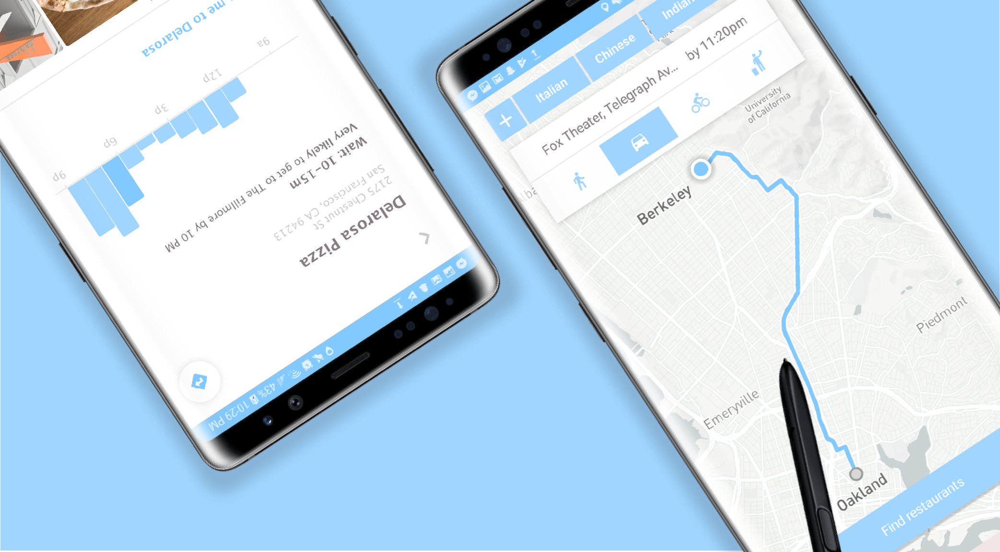

[CS 160](https://www2.eecs.berkeley.edu/Courses/CS160/) is UC Berkeley’s course in User Interface Design & Development. I took the course in Spring 2018 because of my passion for interaction-driven engineering. The class was divided into teams which each developed an Android application from the ground up, starting with brainstorming and then moving through the iterative design process of sketching, prototyping, UER development, user testing, and production. I enjoyed CS 160 so much that I am now a GSI on the course staff for Fall 2018!

My team developed an Android app called Dinestination, an application that determines the best place for a user to eat based on time constraints and target destination. Feel free to check out our [source code](https://github.com/adrianababakanian/busybears) and [final project video](https://github.com/adrianababakanian/busybears)!



In this section I focus on detailing my technical development process behind the app's implementation. Please find details about my iterative design process, informed visual decisions, and user experience research under my [design documentation](localhost:8000/design/dinestination) for the project.

detailing my design process behind the visual interface development. For technical details regarding my implementation process, please see the programming section of my site here!

## Motivation
Dinestination aims to solve the on-the-go user's need of finding a place to eat along the way to a particular destination under a time constraint. Despite the robustness of existing mapping applications and restaurant databases, currently no single interface exists for entering a location, time to be there, and an optional set of filters to generate a route and route-optimal restaurants that get the user to their final destination on time. As such, we took on the challenge of combining an array of APIs into a single, intuitive, and flexible interface unifying the existing fragmented workflow across many apps and queries.

Solving this problem inherently required creating multiple levels of abstraction in both the implementation and interface, hence making it conceptually engaging to work on as both a developer and designer.

## Technologies

We used the Mapbox Android SDK, Google Places API, and Android Yelp Fusion API along with our own algorithms to develop the aforementioned interface.

## Implementation Logic
The logic of the app can be outlined in parallel with the user flow. The user inputs a destination, with autocomplete functionality powered by the [Google Places Autocmplete API](https://developers.google.com/places/web-service/autocomplete). Said destination and the user’s current location are passed to the [Mapbox SDK](https://www.mapbox.com/mobile/) to generate a route, which is rendered to the UI while being parsed into equidistant walks in the backend. The density of each walk is determined as a function of the user’s target time to be at their destination, where a more flexible time correlates to less dense division. Each segment’s endpoint then gets a radius, where again a stricter time constraint reduces the radii of the circles generated by each route segments’ endpoints. These generated circles are then passed to [Yelp Fusion API](https://www.yelp.com/fusion), along with any user-specified, restaurant-related filters, to query for restaurants satisfying all user preferences and time constraints.

The user can these easily browse the returned restaurants, supplemented with details and images from [Google Place Photo](https://developers.google.com/places/web-service/photos) data. Once a restaurant and a mode of transport is selected, in-app navigation to the destination is provided via [Mapbox Navigation](https://www.mapbox.com/navigation/).

In short, the application generates restaurants along a navigatable route that meet all user preferences.

## Mapping
I've recently taken up a fascination with mapping interfaces, so my main implementation responsibility on this project was handling all map-related input, data, and queries.

The interface enables user to select their desired mode of transit to the final destination, which is then passed as a &nbsp; ```DirectionsCriteria```&nbsp; to Mapbox.

```java
vBike.setOnClickListener(new View.OnClickListener() {
  @Override
  public void onClick(View view) {
      PROFILE_TYPE = DirectionsCriteria.PROFILE_CYCLING;
      findRestaurantsButton.setVisibility(View.VISIBLE);
      drawRoute();
  }
});
```

The ```drawRoute``` function handles generating and rendering the route to the interface based on the user input criteria.

```java
private void drawRoute() {
    if (mapboxMap != null) mapboxMap.clear();

    originPos = com.mapbox.geojson.Point.fromLngLat(
      originLoc.getLongitude(),
      originLoc.getLatitude());

    setBoundaries();
    getRoute(originPos, destinationPos);

    LatLng swCorner = new LatLng(southPoint, westPoint);
    LatLng neCorner = new LatLng(northPoint, eastPoint);

    LatLngBounds latLngBounds = new LatLngBounds.Builder()
            .include(swCorner)
            .include(neCorner)
            .build();

    mapboxMap.easeCamera(CameraUpdateFactory.newLatLngBounds(
      latLngBounds, 200, 600, 200, 400), 2000
    );
}
```

Queried restaruants that satisy the user-input filters are rendered the UI as markers on the Mapbox data layer. This is handled in the ```addMarkers``` implementation.

``` java
private void addMarkers() {
    if (!ADDED_MARKERS) {
        List<Feature> features = new ArrayList<>();

        /* Source: A data source specifies the geographic
         * coordinate where the image marker gets placed.
         */
        features.add(Feature.fromGeometry(
          Point.fromCoordinates(new double[] {
            originLocation.getLongitude(),originLocation.getLatitude()
          }))
        );

        FeatureCollection featureCollection = FeatureCollection.fromFeatures(features);
        GeoJsonSource source = new GeoJsonSource(MARKER_SOURCE, featureCollection);

        mapboxMap.addSource(source);

        /* Style layer: A style layer ties together the source
         * and image and specifies how they are displayed on the map.
         */
        SymbolLayer markerStyleLayer = new SymbolLayer(MARKER_STYLE_LAYER, MARKER_SOURCE)
                .withProperties(
                        PropertyFactory.iconAllowOverlap(true),
                        PropertyFactory.iconImage(MARKER_IMAGE)
                );
        mapboxMap.addLayer(markerStyleLayer);
    }

    ADDED_MARKERS = Boolean.TRUE;
}
```
